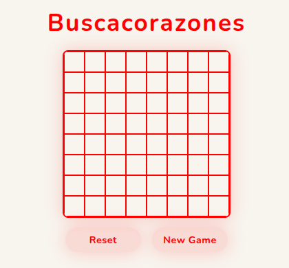

# ❤️ Heartsweeper

<p align="center">
  
</p>

A Minesweeper-inspired browser game where mines are replaced with hearts. Built with vanilla JavaScript and a modern dark UI.

🌐 **Live demo:** [heartsweeper.irenemendoza.dev](https://heartsweeper.irenemendoza.dev/)

---

## ✨ Features

* 🟫 Two board sizes: 8×8 and 16×16
* 🎯 Three difficulty levels: Easy, Medium, Hard
* 💥 Cascade opening of empty cells
* ⏱️ In-game timer
* 🏆 Global leaderboard powered by Cloudflare D1
* 💖 Animated falling hearts on winning

---

## 🛠️ Tech Stack


* **Vite** — dev server and bundler
* **Sass** — styling
* **Cloudflare Workers** — serverless API handling score reads and writes
* **Cloudflare D1** — leaderboard persistence (SQLite at the edge)
* **SweetAlert2** — custom modals replacing native browser `alert` and `prompt`

---

## 🚀 Getting Started

### Prerequisites

* Node.js


### Installation
```bash
npm install
```

### Run in development
```bash
npm run dev
```

### Build for production
```bash
npm run build
```


## 🔧 API (Cloudflare Worker)

The backend lives in `heartsweeper-api/` and is deployed as a Cloudflare Worker backed by a D1 database.

### Endpoints

| Method | Path | Description |
|--------|------|-------------|
| `POST` | `/api/scores` | Save a score |
| `GET` | `/api/scores?rows=&cols=&difficulty=` | Get top 5 scores |

### Deploy the Worker
```bash
cd heartsweeper-api
wrangler deploy
```
---

## 🎮 How to Play

1. Choose a board size and difficulty level when prompted.
2. Left-click a cell to reveal it.
3. Avoid the hearts — if you click one, you lose. 💔
4. Numbers show how many hearts are adjacent to a cell.
5. Reveal all non-heart cells to win and submit your score to the leaderboard. 🏆