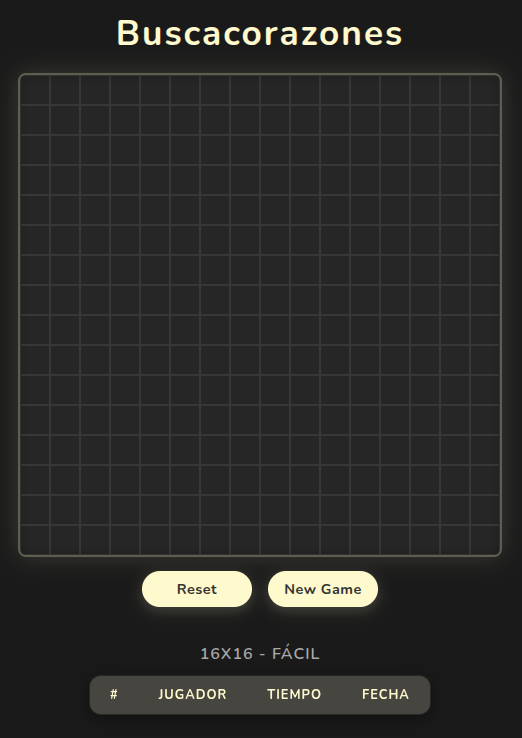

# 💜 Heartsweeper

<p align="center">
  
</p>

A Minesweeper-inspired browser game where mines are replaced with hearts. Built with vanilla JavaScript and a modern dark UI.

---

## ✨ Features

* 🟫 Two board sizes: 8×8 and 16×16
* 🎯 Three difficulty levels: Easy, Medium, Hard
* 💥 Cascade opening of empty cells
* ⏱️ In-game timer
* 🏆 Global leaderboard powered by Supabase
* 💖 Animated falling hearts on winning

---

## 🛠️ Tech Stack


* **Vite** — dev server and bundler
* **Sass** — styling
* **Supabase** — leaderboard persistence (PostgreSQL + REST API)

---

## 🚀 Getting Started

### Prerequisites

* Node.js
* A **Supabase** project with a `rankings` table

### Supabase table setup

Run this in the Supabase SQL editor:
```sql
CREATE TABLE rankings (
  id uuid PRIMARY KEY DEFAULT gen_random_uuid(),
  rows int NOT NULL,
  cols int NOT NULL,
  difficulty text NOT NULL,
  player_name text NOT NULL,
  time_ms int NOT NULL,
  created_at timestamptz DEFAULT now()
);

-- Allow anonymous reads and inserts
CREATE POLICY "Allow anonymous selects" ON public.rankings FOR SELECT TO anon USING (true);
CREATE POLICY "Allow anonymous inserts" ON public.rankings FOR INSERT TO anon WITH CHECK (true);

ALTER TABLE public.rankings ENABLE ROW LEVEL SECURITY;
```

### Installation
```bash
npm install
```

### Environment variables

Create a `.env` file at the project root:
```
VITE_SUPABASE_URL=your_supabase_project_url
VITE_SUPABASE_ANON_KEY=your_supabase_anon_key
```

### Run in development
```bash
npm run dev
```

### Build for production
```bash
npm run build
```

---

## 🎮 How to Play

1. Choose a board size and difficulty level when prompted.
2. Left-click a cell to reveal it.
3. Avoid the hearts — if you click one, you lose. 💔
4. Numbers show how many hearts are adjacent to a cell.
5. Reveal all non-heart cells to win and submit your score to the leaderboard. 🏆